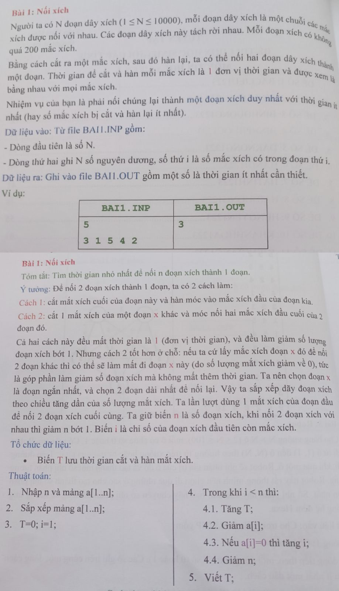
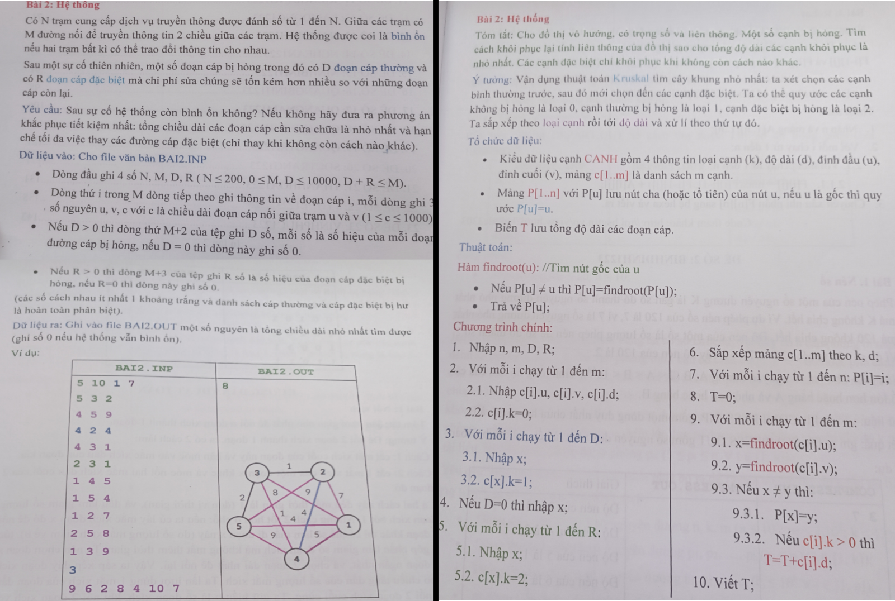
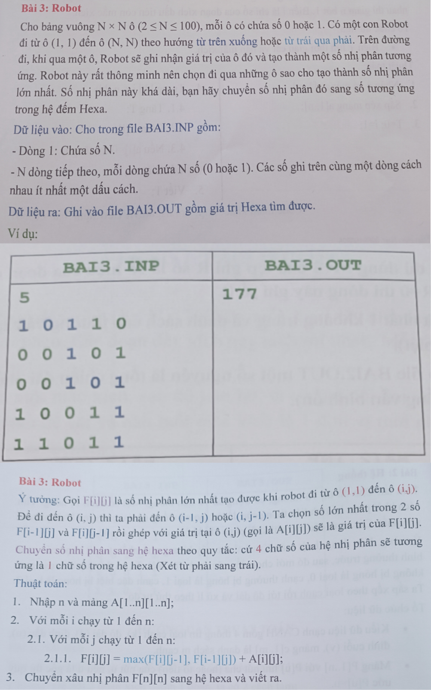

<h3 align="center">  </h3>

 
  <a href="#problems"><kbd>   Các đề   </kbd></a>&ensp;&ensp;
  <a href="https://www.youtube.com/playlist?list=PLDtGd5Fw5_GjXCznR0BzCJJDIQSZJRbxx"><kbd>   Youtube   </kbd></a>&ensp;&ensp;
  <a href="https://github.com/JaKooLit/Hyprland-Dots/wiki"><kbd>   Wiki   </kbd></a>&ensp;&ensp;
  <a href="https://github.com/JaKooLit/Hyprland-Dots/discussions"><kbd>   Discussions   </kbd></a>&ensp;&ensp;
  <a href="https://github.com/JaKooLit/Hyprland-Dots/wiki/Keybinds"><kbd>   Keybinds   </kbd></a>&ensp;&ensp;
  <a href="https://github.com/JaKooLit/Hyprland-Dots/wiki/FAQ"><kbd>   FAQ   </kbd></a>&ensp;&ensp;
  <a href="#chú"><kbd>   Discord   </kbd></a>

 
## Problems
### 👁️‍🗨️ Các đề cần được giải:

- [Bạc Liêu 12 2023](#Bạc-Liêu)

> [!IMPORTANT]
> Không phải bài nào kết quả cũng tuyệt đối
> Có thuật toán tối ưu hơn hoặc đề xuất xin hãy gửi trong issues

##  Chú-ý ⚠️
> [!CAUTION]
> Tạo issue nếu có ý tưởng cần bàn 
> Gửi mail tại: marino.kari24@gmail.com
> Đây chỉ là trang chia sẻ kiến thức của các HS THPT (hoặc Sinh viên Đại Học).

## Các câu chưa giải được (có kèm thuật toán đề xuất):

## Bạc-Liêu:
**B1:**
  

**B2:**

**B3:**

## [Test case!](https://github.com/baotrwg/HSG11-2025/tree/main/B%E1%BA%A1c-Li%C3%AAu-12-2023/Cases)
